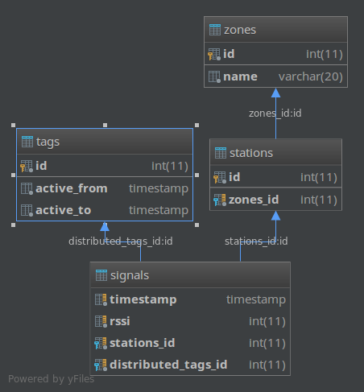
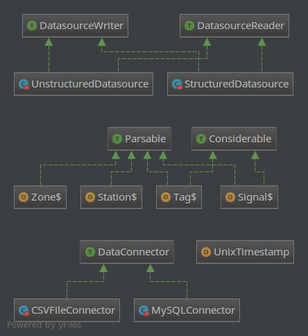

#### 1. Database relations (MySQL)

Scripts to create mysql tables are in: mysql.sql

Datastore configuration instances are defined in: datastore.json

#### 2. Scala project (short-UML)

Running:

The best way to run it is using IntelliJ IDEA with The Scala plugin.

 Scala entry points are in: src/main/scala/com/waytation/conference/jobs

 1. PrepareDatastoreJob.scala -> ensures that the MySQL tables are empty.

 2. DatastoreJob.scala  -> Spark job that's used to clean data from csv files and populate mysql tables.

 3. AnalysisJob.scala -> Spark job that computes all results.

 Note: I imported data from the CSV files and then saved the cleaned data
  to MySQL database, but to disk too (CSV out-folder from datastore.json CSV configuration) because reading data from disk (SSD) was a lot faster than from my local SQL database.

#### 3. Analysis

**Presence criteria**
1. average RSSI level: -82
2. RSSI threshold presence level: -85
3. max timestamp difference between two consecutive records for ongoing presence status: 1 min   if | t1 - t2 | > 1 min, attendee has probably left the room by now

|day| the most popular zone  |
|:--:|:---:|
|1  |Room 1|
|2  |Room 1|
|3  |Room 2|
|4  |Room 1|
|5  |Room 3|

|number of distinct visitors|
|:--------:|
|1730    |

|number of distinct visitors spending at least 30 mins in any zone|
|:--------:|
|3 (to small, probably the presence criteria isn't nicely chosen)   |

|hour| average number of tags                 |
|:--:|:--------------------------------------:|
|10  |244         |
|11  |217         |
|12  |219         |
|13  |202         |
|14  |217         |
|15  |279         |
|16  |129         |

#### 3. Visualizations (Bonus)

I didn't have enough time to finish it, but the first pick would be:
1. python + matplotlib in jupyter notebook
2. https://stackoverflow.com/questions/4090383/plotting-unix-timestamps-in-matplotlib

#### 4. Ideas

1. Go wild on what you could do with spatio-temporal visitor data.

Maybe include some real-time tracking of number of tags (attendees) present at one station
and then suggest some kind of action (to start playing louder music if it's too crowded, send more staff, ...)

2. How would you calculate more precise locations?

Make a better research that will find out what's the best RSSI signal threshold based on signals and maybe use a distance between stations that will be measured before the conference starts.

3. How would you design an efficient system for ingesting and analyzing this kind of data?

Maybe try with a lambda architecture (Batch & Streaming layers):

- Batch layer => Would analyize data at the end of each day during a conference week
              => It would handle heavy stats that need some time to compute the results and that request a bigger context at once (more data) to make some conclusions.
                 (For instance: What was the most crowded station and how trends were changing during a day...)

- Streaming layer => Would analyize data in a near real-time, as the new instances of data come to system
                  => It would handle data in a little batches (collected every minute or so) and do some faster analytics
                  or it will make the system aware of trends in a near real-time so it could respond to a new situation that constantly changes.
                  (For instance: It could show how many empty seats are left in a conference room during a conference talk ...)

4. Which questions would you like to answer and which analyses would you implement?

It can be implemented using Apache Kafka + Spark Streaming or even give a try with the Structured Streaming.
https://spark.apache.org/docs/latest/structured-streaming-programming-guide.html